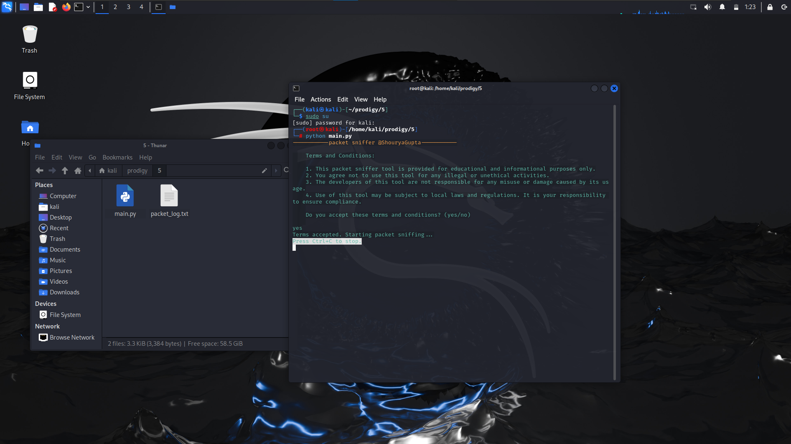
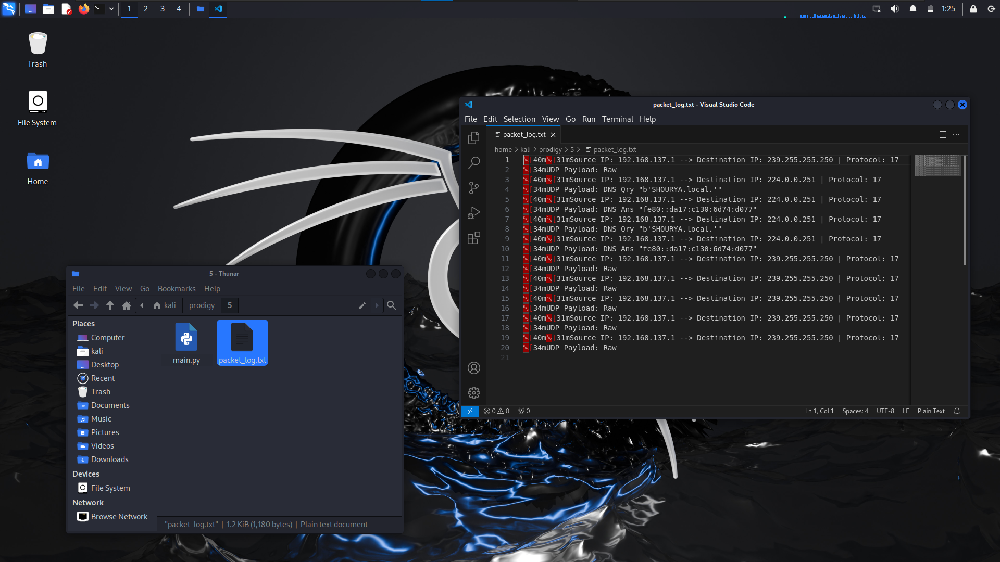

# Network Packet Analyser
> Prodigy InfoTech Internship (Task_05)

* Develop a packet sniffing tool that captures and analyses network packets.

```

  "Author": "Shourya Gupta",
  "Language": "Python",

```
***
## Task list
- [x] Create a dialog box to start analysing the default name of the network from the pre-defined models
- [ ] Capture the packet information from the network interface selected.
- [ ] Display relevent information which must include
- Source IP
- Destination IP
- Payload Data
- [ ] Make sure to store the log in a txt file for analysis and future reference.

## Dependencies

```
pip install scapy colorama
```
***
***
### Running the code on linux
```
sudo su
```
- Enter the password of your machine/ operating system.
```
python main.py
```

- Accept the terms and conditions.
- Click on start capture.

- Press Ctrl + C to stop
- Open ``` packet_log.txt``` to study the connections and analyse the load on the device.

---
## Output Snapshot
<p align="center"></p>
<p align="center"></p>
